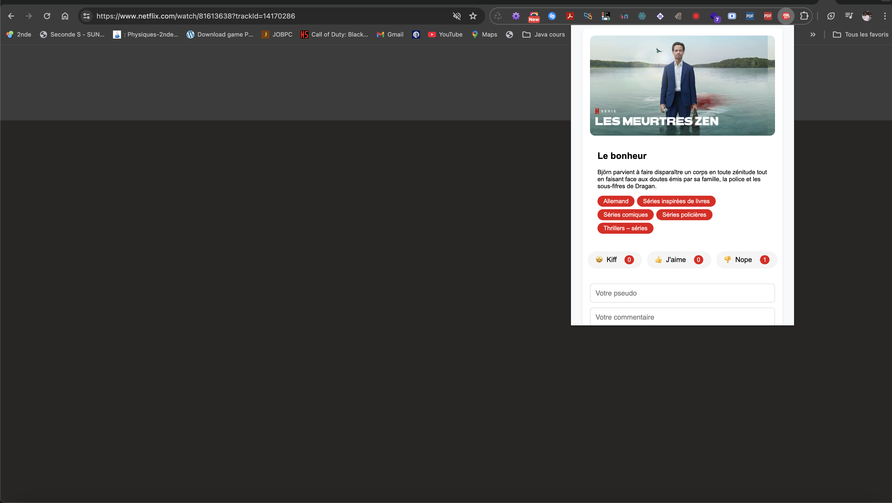
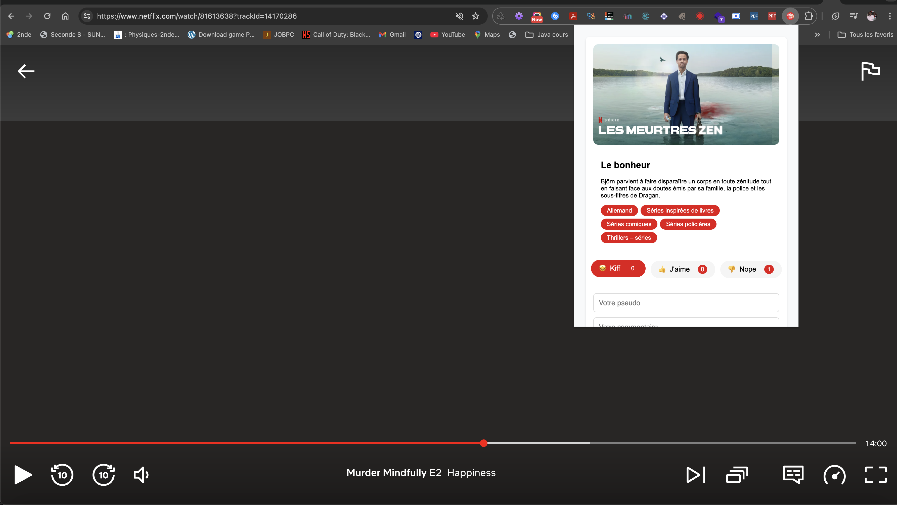

# WatchMate 🎬

<div align="center">

  <!-- Bannière du plugin (Remplacer l'URL par votre bannière) -->
  

  <!-- Icon du plugin (Remplacer l'URL par votre icône) -->
  
  <br/>

*Partagez votre expérience Netflix avec la communauté !* 🍿
</div>

## 📖 À propos

WatchMate est une extension Chrome qui transforme votre expérience Netflix en une aventure communautaire ! Notez, commentez et partagez vos impressions sur vos films et séries préférés en temps réel.

> 🎓 **Projet éducatif** créé par **Hamadou BA**

🎥 Démonstration
<div align="center">
  <video width="100%" controls>
    <source src="readme_assets/video.mp4" type="video/mp4">
    Votre navigateur ne supporte pas la lecture de vidéos.
  </video>
</div>
📸 Captures d'écran
<div align="center">
  
  <p><em>Interface principale de WatchMate</em></p>
  
  <p><em>Système de notation intuitif</em></p>
  
  <p><em>Espace de commentaires communautaire</em></p>
</div>

## ✨ Fonctionnalités

### 🌟 Système de notation intuitif
- **Kiff** 🤩 - Pour les contenus exceptionnels
- **J'aime** 👍 - Pour les bons moments
- **Nope** 👎 - Pour les déceptions

### 💬 Espace communautaire
- Commentez en temps réel
- Partagez vos impressions
- Découvrez l'avis des autres spectateurs

### 🎯 Interface intuitive
- Design moderne et épuré
- Intégration naturelle avec Netflix
- Mise à jour en temps réel

## 🚀 Installation

1. Téléchargez l'extension
2. Ouvrez Chrome
3. Allez dans `chrome://extensions/`
4. Activez le "Mode développeur"
5. Cliquez sur "Charger l'extension non empaquetée"
6. Sélectionnez le dossier de l'extension

## 🛠️ Technologies utilisées

- JavaScript
- HTML/CSS
- API Netflix
- API personnalisée

## 📁 Structure du projet

```
watchmate/
├── manifest.json
├── popup.html
├── popup.js
├── content.js
├── icon.png
├── banner.png
└── README.md
```

## 🤝 Comment contribuer

1. Fork le projet
2. Créez votre branche (`git checkout -b mabranche`)
3. Committez vos changements (`git commit -m 'Add some AmazingFeature'`)
4. Push sur la branche (`git push origin mabranche`)
5. Ouvrez une Pull Request

## 📝 Notes

- Extension créée dans un but pédagogique
- Nécessite une connexion Internet
- Fonctionne exclusivement sur Netflix

## 👨‍💻 Auteur

**Hamadou BA**

## 📫 Contact

Des questions ? Des suggestions ? N'hésitez pas à me contacter !

---

<div align="center">

*Fait avec ❤️ pour la communauté Netflix*

[Report Bug](https://github.com/votre-repo/issues) · [Request Feature](https://github.com/votre-repo/issues)
</div>
